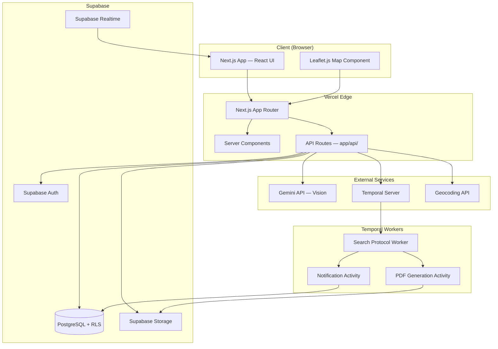
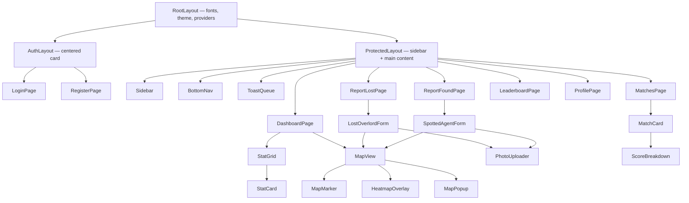
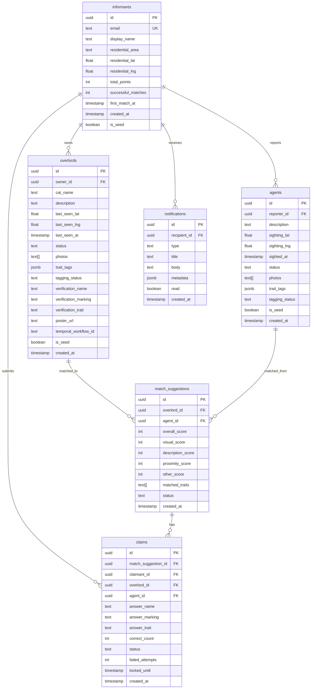

# Design Document: MEOWTRIX — Feline Overlord Tracker

## Overview

MEOWTRIX is a spy-agency themed web application for tracking and recovering lost cats. The system allows users ("Informants") to report lost cats ("Overlords"), report found cats ("Agents"), leverage AI-powered image analysis for matchmaking, and coordinate recovery via escalating notification workflows.

The application is built as a Next.js App Router application with a dark-mode command-center aesthetic, featuring an interactive Leaflet.js map as the hero component, Supabase for data persistence and auth, Temporal for background workflows, and Gemini API for AI vision tagging.

### Key Design Decisions

1. **Server Components by default** — minimize client JS bundle; only mark components as `"use client"` when they need browser APIs (map, forms, real-time subscriptions).
2. **Supabase RLS as the security boundary** — all data access policies enforced at the database level, API routes act as thin orchestration layers.
3. **Temporal for durable workflows** — the Escalating Search Protocol and PDF generation are long-running, time-sensitive processes that benefit from Temporal's replay guarantees.
4. **Edge-compatible API routes** — API routes under `app/api/` handle server-side Supabase calls and external service orchestration (Gemini, Temporal).
5. **Dynamic Leaflet import** — Leaflet requires the DOM, so all map components are loaded with `next/dynamic` and `ssr: false`.

---

## Architecture

### High-Level System Diagram



### Directory Structure

```
meowtrix/
├── app/
│   ├── layout.tsx                  # Root layout (dark theme, fonts)
│   ├── page.tsx                    # Redirect to /dashboard or /auth/login
│   ├── (auth)/
│   │   ├── login/page.tsx
│   │   ├── register/page.tsx
│   │   └── layout.tsx              # Auth layout (no sidebar)
│   ├── (protected)/
│   │   ├── layout.tsx              # Dashboard layout (sidebar + nav)
│   │   ├── dashboard/page.tsx      # HQ Dashboard
│   │   ├── report-lost/page.tsx    # Lost Overlord form
│   │   ├── report-found/page.tsx   # Spotted Agent form
│   │   ├── matches/page.tsx        # Match suggestions list
│   │   ├── matches/[id]/page.tsx   # Match detail + claim
│   │   ├── overlords/[id]/page.tsx # Overlord detail view
│   │   ├── agents/[id]/page.tsx    # Agent detail view
│   │   ├── leaderboard/page.tsx    # Leaderboard
│   │   └── profile/page.tsx        # Informant profile
│   └── api/
│       ├── auth/
│       │   ├── register/route.ts
│       │   ├── login/route.ts
│       │   └── callback/route.ts   # OAuth callback
│       ├── overlords/
│       │   ├── route.ts            # POST create, GET list
│       │   └── [id]/route.ts       # GET detail, PATCH update, DELETE
│       ├── agents/
│       │   ├── route.ts            # POST create, GET list
│       │   └── [id]/route.ts       # GET detail, PATCH, DELETE
│       ├── vision/
│       │   └── process/route.ts    # Trigger Gemini processing
│       ├── matches/
│       │   ├── route.ts            # GET list matches
│       │   └── [id]/
│       │       ├── route.ts        # GET match detail
│       │       └── claim/route.ts  # POST initiate claim
│       ├── claims/
│       │   └── [id]/
│       │       └── verify/route.ts # POST verify claim answers
│       ├── notifications/
│       │   └── route.ts            # GET notifications for user
│       ├── leaderboard/route.ts    # GET leaderboard
│       ├── stats/route.ts          # GET dashboard stats
│       ├── upload/route.ts         # POST image upload + optimization
│       └── seed/route.ts           # POST trigger seed data
├── components/
│   ├── ui/                         # shadcn/ui components
│   ├── map/
│   │   ├── MapView.tsx             # Main map wrapper (dynamic import)
│   │   ├── MapMarker.tsx           # Pin component
│   │   ├── HeatmapOverlay.tsx      # Probability zone overlay
│   │   └── MapPopup.tsx            # Popup on marker click
│   ├── layout/
│   │   ├── Sidebar.tsx             # Desktop sidebar nav
│   │   ├── BottomNav.tsx           # Mobile bottom nav
│   │   └── ToastQueue.tsx          # Notification toast manager
│   ├── dashboard/
│   │   ├── StatCard.tsx            # Stat card with loading state
│   │   └── StatGrid.tsx            # Grid of stat cards
│   ├── forms/
│   │   ├── LostOverlordForm.tsx    # Report lost cat form
│   │   ├── SpottedAgentForm.tsx    # Report found cat form
│   │   ├── ClaimVerificationForm.tsx
│   │   └── PhotoUploader.tsx       # Multi-image upload component
│   ├── matches/
│   │   ├── MatchCard.tsx           # Match suggestion card
│   │   └── ScoreBreakdown.tsx      # Visual score breakdown
│   └── leaderboard/
│       ├── LeaderboardTable.tsx    # Data table with ranking
│       └── ShareButton.tsx         # Social sharing
├── hooks/
│   ├── useSupabase.ts              # Supabase client hook
│   ├── useAuth.ts                  # Auth state hook
│   ├── useRealtime.ts             # Realtime subscription hook
│   ├── useGeolocation.ts          # Browser geolocation hook
│   └── useNotifications.ts        # Notification polling/realtime
├── lib/
│   ├── supabaseClient.ts          # Supabase browser client
│   ├── supabaseServer.ts          # Supabase server client
│   ├── gemini.ts                  # Gemini API client
│   ├── matchEngine.ts             # Match scoring algorithm
│   ├── heatmapCalc.ts             # Heatmap radius calculation
│   ├── imageOptimizer.ts          # Image compression/conversion
│   ├── geocoding.ts               # Geocoding utility
│   ├── geodesic.ts                # Distance calculations
│   └── validators.ts              # Zod schemas for validation
├── temporal/
│   ├── workflows/
│   │   └── searchProtocol.ts      # Escalating Search Protocol workflow
│   ├── activities/
│   │   ├── sendNotification.ts    # Notification delivery
│   │   ├── generatePoster.ts      # PDF poster generation
│   │   └── findNearbyInformants.ts # Proximity query
│   └── worker.ts                  # Temporal worker entry point
├── types/
│   └── index.ts                   # Shared TypeScript interfaces
└── scripts/
    └── seed.ts                    # Seed data script
```

### Request Flow

1. **Authenticated request** → Next.js middleware checks Supabase session → routes to Server Component or API route
2. **API route** → validates input (Zod) → calls Supabase with service role or user token → returns JSON
3. **Vision processing** → API route triggers Gemini → stores tags → triggers Match Engine evaluation
4. **Match Engine** → runs in API route context → compares traits/location/text → persists match suggestions → triggers notifications
5. **Search Protocol** → Temporal workflow started on Overlord creation → sleeps for escalation intervals → executes notification activities

---

## Components and Interfaces

### Core Component Hierarchy



### Key Interfaces

```typescript
// types/index.ts

interface Informant {
  id: string;
  email: string;
  display_name: string;
  residential_area: string;
  residential_lat: number | null;
  residential_lng: number | null;
  total_points: number;
  successful_matches: number;
  created_at: string;
}

interface Overlord {
  id: string;
  owner_id: string;
  cat_name: string;
  description: string;
  last_seen_lat: number;
  last_seen_lng: number;
  last_seen_at: string;
  status: 'active' | 'resolved';
  photos: string[];
  trait_tags: TraitTags | null;
  tagging_status: 'pending' | 'complete' | 'incomplete' | 'manual_review';
  verification_name: string;       // encrypted/hidden from non-owners
  verification_marking: string;    // encrypted/hidden from non-owners
  verification_trait: string;      // encrypted/hidden from non-owners
  poster_url: string | null;
  is_seed: boolean;
  created_at: string;
}

interface Agent {
  id: string;
  reporter_id: string;
  description: string;
  sighting_lat: number;
  sighting_lng: number;
  sighted_at: string;
  status: 'active' | 'resolved';
  photos: string[];
  trait_tags: TraitTags | null;
  tagging_status: 'pending' | 'complete' | 'incomplete' | 'manual_review';
  is_seed: boolean;
  created_at: string;
}

interface TraitTags {
  primary_color: string;
  secondary_color: string | null;
  pattern_type: 'solid' | 'tabby' | 'calico' | 'bicolor' | 'tortoiseshell' | 'pointed' | 'tuxedo';
  fur_length: 'short' | 'medium' | 'long';
  breed_estimate: string;
  distinguishing_features: string[];  // max 5
}

interface MatchSuggestion {
  id: string;
  overlord_id: string;
  agent_id: string;
  overall_score: number;            // 0-100
  visual_score: number;             // 0-100
  description_score: number;        // 0-100
  proximity_score: number;          // 0-100
  other_score: number;              // 0-100
  matched_traits: string[];
  status: 'pending' | 'claimed' | 'resolved' | 'rejected';
  created_at: string;
}

interface Claim {
  id: string;
  match_suggestion_id: string;
  claimant_id: string;              // must be the overlord owner
  overlord_id: string;
  agent_id: string;
  answer_name: string;
  answer_marking: string;
  answer_trait: string;
  correct_count: number;
  status: 'pending' | 'verified' | 'rejected' | 'locked';
  failed_attempts: number;
  locked_until: string | null;
  created_at: string;
}

interface Notification {
  id: string;
  recipient_id: string;
  type: 'match_alert' | 'escalation' | 'claim_verified' | 'claim_rejected' | 'overlord_resolved' | 'search_concluded';
  title: string;
  body: string;
  metadata: Record<string, unknown>;
  read: boolean;
  created_at: string;
}

interface LeaderboardEntry {
  rank: number;
  informant_id: string;
  display_name: string;
  total_points: number;
  successful_matches: number;
  first_match_at: string | null;
}
```

### API Route Contracts

| Route | Method | Description | Auth |
|-------|--------|-------------|------|
| `/api/auth/register` | POST | Register new Informant | Public |
| `/api/auth/login` | POST | Sign in | Public |
| `/api/auth/callback` | GET | OAuth callback | Public |
| `/api/overlords` | POST | Create Overlord record | Required |
| `/api/overlords` | GET | List Overlords (with filters) | Required |
| `/api/overlords/[id]` | GET | Get Overlord detail | Required |
| `/api/overlords/[id]` | PATCH | Update Overlord (owner only) | Required |
| `/api/overlords/[id]` | DELETE | Delete Overlord (owner only) | Required |
| `/api/agents` | POST | Create Agent record | Required |
| `/api/agents` | GET | List Agents (with filters) | Required |
| `/api/agents/[id]` | GET | Get Agent detail | Required |
| `/api/agents/[id]` | PATCH | Update Agent (reporter only) | Required |
| `/api/agents/[id]` | DELETE | Delete Agent (reporter only) | Required |
| `/api/vision/process` | POST | Trigger Gemini vision on record | Required |
| `/api/matches` | GET | List match suggestions | Required |
| `/api/matches/[id]` | GET | Get match detail | Required |
| `/api/matches/[id]/claim` | POST | Initiate claim verification | Required |
| `/api/claims/[id]/verify` | POST | Submit claim answers | Required |
| `/api/notifications` | GET | Get user notifications | Required |
| `/api/leaderboard` | GET | Get leaderboard (paginated) | Required |
| `/api/stats` | GET | Dashboard statistics | Required |
| `/api/upload` | POST | Upload + optimize image | Required |
| `/api/seed` | POST | Trigger seed data | Admin |

---

## Data Models

### Database Schema (Supabase PostgreSQL)



### Row Level Security Policies

| Table | Policy | Rule |
|-------|--------|------|
| `informants` | SELECT own | `auth.uid() = id` |
| `informants` | UPDATE own | `auth.uid() = id` |
| `overlords` | SELECT all authenticated | `auth.role() = 'authenticated'` |
| `overlords` | INSERT own | `auth.uid() = owner_id` |
| `overlords` | UPDATE own | `auth.uid() = owner_id` |
| `overlords` | DELETE own | `auth.uid() = owner_id` |
| `agents` | SELECT all authenticated | `auth.role() = 'authenticated'` |
| `agents` | INSERT own | `auth.uid() = reporter_id` |
| `agents` | UPDATE own | `auth.uid() = reporter_id` |
| `agents` | DELETE own | `auth.uid() = reporter_id` |
| `match_suggestions` | SELECT all authenticated | `auth.role() = 'authenticated'` |
| `claims` | SELECT involved parties | `auth.uid() = claimant_id OR auth.uid() IN (overlord owner, agent reporter)` |
| `claims` | INSERT own | `auth.uid() = claimant_id` |
| `notifications` | SELECT own | `auth.uid() = recipient_id` |
| `notifications` | UPDATE own (mark read) | `auth.uid() = recipient_id` |

**Note:** Verification fields (`verification_name`, `verification_marking`, `verification_trait`) on `overlords` are excluded from the default SELECT policy columns. A database function handles comparison without exposing values.

### Supabase Storage Buckets

| Bucket | Access | Purpose |
|--------|--------|---------|
| `cat-photos` | Read: all authenticated; Write: authenticated; Delete: owner only | Optimized cat images |
| `posters` | Read: all authenticated; Write: service role only | Generated PDF missing posters |

---


## Subsystem Designs

### 1. Authentication Subsystem (Auth_Service)

**Flow:**
1. Registration: Client → `POST /api/auth/register` → Supabase Auth `signUp` → create `informants` row → geocode residential area → store coordinates
2. Login: Client → `POST /api/auth/login` → Supabase Auth `signInWithPassword` → return session
3. OAuth: Client → Supabase Auth redirect → callback at `/api/auth/callback` → create/update `informants` row
4. Session: Supabase manages JWT with 7-day inactivity expiry; middleware validates on every protected route

**Geocoding:** Use a free geocoding service (Nominatim/OpenStreetMap) to convert `residential_area` text to lat/lng. Store coordinates for proximity calculations. If geocoding fails, store `null` coordinates and prompt user to update in profile.

**Middleware Pattern:**
```typescript
// middleware.ts
export async function middleware(request: NextRequest) {
  const supabase = createMiddlewareClient({ req: request });
  const { data: { session } } = await supabase.auth.getSession();
  
  if (!session && request.nextUrl.pathname.startsWith('/(protected)')) {
    const redirectUrl = new URL('/login', request.url);
    redirectUrl.searchParams.set('redirect', request.nextUrl.pathname);
    return NextResponse.redirect(redirectUrl);
  }
}
```

---

### 2. Image Upload & Optimization Subsystem (Image_Optimizer)

**Flow:**
1. Client uploads image via `PhotoUploader` component → `POST /api/upload`
2. API route validates format (JPEG/PNG/WebP) and size (≤5MB)
3. `imageOptimizer.ts` processes:
   - Convert JPEG/PNG → WebP (quality 75, targeting 40%+ reduction)
   - Re-compress WebP (quality 80, targeting 20%+ reduction)
   - Downscale if longest edge > 2048px (maintain aspect ratio, min 800px)
   - Verify SSIM ≥ 0.85 (using sharp library)
4. Upload optimized image to Supabase Storage `cat-photos` bucket
5. Return public URL
6. If optimization fails within 10s timeout, store original unchanged

**Library:** `sharp` for image processing (WebP conversion, resize, quality control).

---

### 3. AI Vision Tagging Subsystem (Vision_Service)

**Flow:**
1. After image upload completes → `POST /api/vision/process` triggered (can be async via queue or immediate)
2. Send image URL to Gemini API with structured prompt requesting trait extraction
3. Parse Gemini response into `TraitTags` structure
4. For multi-photo records: merge tags using frequency-based selection (ties → most recent photo wins)
5. Store consolidated `trait_tags` on the record
6. Mark record as `tagging_status: 'complete'`
7. Trigger Match Engine evaluation

**Gemini Prompt Template:**
```
Analyze this cat photo and extract the following traits in JSON format:
- primary_color: main body color
- secondary_color: secondary color if present, null otherwise
- pattern_type: one of [solid, tabby, calico, bicolor, tortoiseshell, pointed, tuxedo]
- fur_length: one of [short, medium, long]
- breed_estimate: best guess or "unknown"
- distinguishing_features: up to 5 notable physical features (eye color, ear shape, etc.)
```

**Retry Logic:** 30-second timeout per request. On failure, retry once. If retry fails, mark as `manual_review`.

---

### 4. Match Engine Subsystem (Match_Engine)

**Scoring Algorithm:**

```typescript
function calculateMatchScore(overlord: Overlord, agent: Agent): number {
  const visualScore = calculateVisualSimilarity(overlord.trait_tags, agent.trait_tags);   // 40%
  const descScore = calculateTextSimilarity(overlord.description, agent.description);     // 25%
  const proximityScore = calculateProximityScore(overlord, agent);                        // 25%
  const otherScore = calculateOtherFields(overlord.trait_tags, agent.trait_tags);         // 10%
  
  return Math.round(
    visualScore * 0.40 +
    descScore * 0.25 +
    proximityScore * 0.25 +
    otherScore * 0.10
  );
}
```

**Visual Similarity (40%):** Compare each trait tag field. Exact matches score 100 per field. Partial matches (e.g., similar colors) score proportionally. Average across all fields.

**Text Similarity (25%):** Use token overlap (Jaccard similarity) between description texts. Normalize to 0-100 scale.

**Proximity Score (25%):** Inverse linear distance function:
- ≤ 500m → 100
- 500m to 10km → linear interpolation from 100 to 0
- \> 10km → 0

**Other Fields (10%):** Compare `breed_estimate` and `fur_length` for exact/partial matches.

**Threshold:** Only persist match suggestions with score ≥ 60. Maximum 10 suggestions per Overlord (ranked by score descending).

**Trigger:** Runs when a new Agent or Overlord gets trait tags. Skips records without tags. Must complete within 60 seconds.

---

### 5. Heatmap Engine Subsystem (Heatmap_Engine)

**Radius Calculation:**
```typescript
function calculateHeatmapRadius(lastSeenAt: Date): number {
  const elapsedHours = (Date.now() - lastSeenAt.getTime()) / (1000 * 60 * 60);
  return Math.max(200, Math.min(5000, 250 * elapsedHours));
}
```

**Rendering:** Client-side Leaflet circle overlay with gradient opacity (0.6 at center → 0 at edge). Recalculated every 5 minutes via `setInterval` on the client.

**Re-centering:** When a new Agent sighting falls within the probability zone, the center shifts to the Agent's sighting location. Elapsed time continues from original Overlord `last_seen_at`.

**Removal:** When Overlord status changes to `resolved`, the overlay is removed from the map within the next render cycle (driven by Supabase Realtime subscription).

---

### 6. Escalating Search Protocol (Search_Protocol — Temporal)

**Workflow Definition:**
```typescript
// temporal/workflows/searchProtocol.ts
export async function searchProtocolWorkflow(overlordId: string): Promise<void> {
  // Stage 1: 6 hours — notify 1km radius
  await sleep('6 hours');
  if (await isOverlordResolved(overlordId)) return;
  await notifyNearbyInformants(overlordId, 1000); // 1km radius

  // Stage 2: 24 hours — generate PDF poster
  await sleep('18 hours'); // 24h total
  if (await isOverlordResolved(overlordId)) return;
  await generateMissingPoster(overlordId);

  // Stage 3: 48 hours — notify 5km radius
  await sleep('24 hours'); // 48h total
  if (await isOverlordResolved(overlordId)) return;
  await notifyNearbyInformants(overlordId, 5000); // 5km, exclude previously notified

  // Stage 4: 14 days — auto-terminate
  await sleep('12 days'); // 14 days total
  if (await isOverlordResolved(overlordId)) return;
  await sendSearchConcludedNotification(overlordId);
}
```

**Activities:**
- `notifyNearbyInformants`: Query informants within radius using PostGIS-style distance calc, send notifications
- `generateMissingPoster`: Create A4 PDF with cat photo, name, traits, location using `@react-pdf/renderer` or `pdfkit`, upload to Storage
- `sendSearchConcludedNotification`: Notify Overlord owner that automated search period ended

**Cancellation:** When Overlord marked as found → cancel Temporal workflow via `workflowHandle.cancel()`.

**Durability:** Temporal replays from last completed stage on system restart. No re-sending of delivered notifications.

---

### 7. Claim Verification Subsystem (Claim_Workflow)

**Flow:**
1. Overlord owner views match suggestion → clicks "Claim" → `POST /api/matches/[id]/claim`
2. Server verifies claimant is the Overlord owner
3. Returns verification form with 3 questions (cat name, physical marking, behavioral trait)
4. Claimant submits answers → `POST /api/claims/[id]/verify`
5. Server compares answers using case-insensitive substring matching (min 3 chars)
6. If ≥ 2/3 correct AND no other verified claim exists → mark verified, notify Agent reporter
7. If < 2/3 correct → reject, increment `failed_attempts`
8. If 3 failures → lock for 24 hours

**Substring Matching Logic:**
```typescript
function verifyAnswer(stored: string, submitted: string): boolean {
  if (submitted.length < 3) return false;
  return stored.toLowerCase().includes(submitted.toLowerCase());
}
```

**Resolution Flow:**
1. Owner marks Overlord as "found" → `PATCH /api/overlords/[id]` with `status: 'resolved'`
2. Cancel Search Protocol Temporal workflow
3. Reject all pending claims on this Overlord
4. If resolution linked to specific Agent → mark Agent as resolved too
5. Cancel other pending match suggestions for both records

---

### 8. Notification Subsystem (Notification_Service)

**Delivery:** In-app only (stored in `notifications` table, delivered via Supabase Realtime subscriptions or polling).

**Toast Display:** Maximum 3 toasts visible simultaneously, 5-second auto-dismiss, queued overflow. Styled as "incoming transmissions" with spy-theme copy.

**Types:**
- `match_alert` — new match suggestion found
- `escalation` — Search Protocol stage triggered (for recipients within radius)
- `claim_verified` — claim passed verification
- `claim_rejected` — claim failed verification
- `overlord_resolved` — an Overlord you had a pending claim on was resolved
- `search_concluded` — 14-day search period ended

---

### 9. Leaderboard Subsystem

**Scoring:** +10 points awarded to the Agent reporter when a claim is verified against their Agent record.

**Ranking:** Descending by `total_points`, ties broken by earliest `first_match_at` timestamp.

**Pagination:** 50 entries per page, server-side pagination via offset/limit.

**Real-time:** Supabase Realtime subscription on `informants` table `total_points` column for live updates (within 5 seconds).

**Social Sharing:** Generate Open Graph meta tags for `/leaderboard` public page showing top 3 ranked Informants with MEOWTRIX branding.

---

### 10. Seed Data Subsystem (Seed_Service)

**Trigger:** CLI script (`npx ts-node scripts/seed.ts`) or environment variable `SEED_DATA=true` on first init.

**Data:**
- 5 Informant accounts with realistic names and Bangkok-area residential areas
- 15 Overlord records (various statuses: active, resolved, pending claim)
- 10 Agent records with sighting locations near Overlord last-seen locations
- Pre-generated trait tags consistent with photos
- 3 match suggestions (scores: 85, 72, 55)
- 2 leaderboard entries with points

**Idempotency:** Check for existing `is_seed = true` records before inserting. Skip if found.

**Cleanup:** `SEED_CLEANUP=true` flag removes all `is_seed` records and associated Storage files.

---


## Correctness Properties

*A property is a characteristic or behavior that should hold true across all valid executions of a system — essentially, a formal statement about what the system should do. Properties serve as the bridge between human-readable specifications and machine-verifiable correctness guarantees.*

### Property 1: Overlord form validation

*For any* cat name string, description string, and last-seen timestamp, the Overlord form validator should accept the input if and only if: the name is between 1 and 50 characters, the description is between 0 and 500 characters, and the timestamp is not in the future and not more than 30 days before the current date.

**Validates: Requirements 2.1, 2.6**

### Property 2: Photo upload validation

*For any* list of files with varying counts (0–10), format types, and file sizes, the photo validator should accept the upload if and only if: the list contains between 1 and 5 files, each file format is one of JPEG, PNG, or WebP, and each file size is ≤ 5MB.

**Validates: Requirements 2.3, 3.3, 3.7**

### Property 3: Gemini response parsing

*For any* valid JSON response from the Gemini API containing trait fields, the parser should produce a TraitTags object with all present fields correctly mapped. For any response missing required fields (primary_color, pattern_type, fur_length), the parser should mark the record as incomplete.

**Validates: Requirements 4.2, 4.5**

### Property 4: Trait tag merging

*For any* list of 1–5 TraitTags objects, the merge function should produce a single consolidated TraitTags where: each single-value field contains the most frequently occurring value across inputs, ties are broken by selecting the value from the most recently uploaded photo, and the distinguishing_features list contains at most 5 entries (the 5 most frequently mentioned if the combined total exceeds 5).

**Validates: Requirements 4.3, 4.7**

### Property 5: Heatmap radius calculation

*For any* non-negative elapsed time value (in hours), the heatmap radius should equal `max(200, min(5000, 250 × elapsed_hours))`, resulting in a value that is always ≥ 200 meters and always ≤ 5000 meters. Additionally, the heatmap should only be displayed when elapsed time exceeds 30 minutes (0.5 hours).

**Validates: Requirements 6.1, 6.2**

### Property 6: Heatmap re-centering on Agent sighting

*For any* Overlord probability zone (defined by a center point and calculated radius) and any Agent sighting location, the zone should re-center on the Agent sighting location if and only if the geodesic distance between the current zone center and the Agent sighting is less than or equal to the zone radius.

**Validates: Requirements 6.5, 6.7**

### Property 7: Geodesic distance function

*For any* two valid geographic coordinate pairs (lat/lng within valid ranges), the geodesic distance function should be: symmetric (distance(A, B) = distance(B, A)), non-negative, zero if and only if A equals B, and satisfy the triangle inequality.

**Validates: Requirements 7.8, 8.8**

### Property 8: Match score weighted formula

*For any* Overlord and Agent pair with valid trait tags, the overall match score should equal `round(visual_score * 0.40 + description_score * 0.25 + proximity_score * 0.25 + other_score * 0.10)` where each component score is in the range [0, 100] and the overall score is in the range [0, 100].

**Validates: Requirements 8.1**

### Property 9: Proximity score formula

*For any* distance value (in meters) between an Agent sighting and an Overlord last-seen location, the proximity score should be: 100 when distance ≤ 500m, 0 when distance ≥ 10000m, and linearly interpolated between 100 and 0 for distances between 500m and 10000m.

**Validates: Requirements 8.8**

### Property 10: Match threshold and ranking

*For any* set of match scores between an Overlord and multiple Agents, match suggestions should be persisted if and only if the score is ≥ 60, the returned list should be sorted in descending order by score, and at most 10 suggestions should be returned per Overlord.

**Validates: Requirements 8.3, 8.5**

### Property 11: No duplicate match suggestions

*For any* Agent-Overlord pair, running the match engine multiple times (including when triggered by record updates) should never produce duplicate match suggestion records for the same pair.

**Validates: Requirements 8.10**

### Property 12: Claim verification substring matching

*For any* stored verification value and any submitted answer string, the verification function should return true if and only if: the answer length is ≥ 3 characters AND the stored value (case-insensitive) contains the answer (case-insensitive) as a substring.

**Validates: Requirements 9.2**

### Property 13: Claim verification decision

*For any* set of 3 verification question results (each true or false), a claim should be marked as verified if and only if the count of correct answers is ≥ 2.

**Validates: Requirements 9.3, 9.4**

### Property 14: Claim lockout enforcement

*For any* claim history where an Informant has accumulated `n` failed attempts for the same Overlord, the system should lock further claim attempts if and only if `n ≥ 3` and the current time is within 24 hours of the last failure. After the 24-hour period, the failed attempt counter should reset to zero.

**Validates: Requirements 9.5**

### Property 15: Owner-only resolution

*For any* Overlord record and any Informant, the resolve action should succeed if and only if the Informant's user ID matches the Overlord's `owner_id` field.

**Validates: Requirements 9.8**

### Property 16: Points calculation

*For any* verified claim event, the Informant who originally reported the associated Agent should have their `total_points` increased by exactly 10 and their `successful_matches` count increased by exactly 1.

**Validates: Requirements 10.1**

### Property 17: Leaderboard ordering

*For any* set of Informants with varying point totals and first-match timestamps, the leaderboard should be sorted in descending order by `total_points`, with ties broken by earliest `first_match_at` timestamp, and each page should contain at most 50 entries.

**Validates: Requirements 10.2**

### Property 18: Toast notification queue

*For any* sequence of incoming notifications with varying arrival times, the toast queue should ensure: at most 3 toasts are visible simultaneously, each toast is displayed for 5 seconds before auto-dismissing, and queued notifications are displayed in FIFO order as visible slots become available.

**Validates: Requirements 11.5**

### Property 19: Verification fields access control

*For any* Overlord record and any Informant who is not the record's owner, API responses and database reads should never include the `verification_name`, `verification_marking`, or `verification_trait` fields.

**Validates: Requirements 2.9, 13.5**

### Property 20: Authentication enforcement

*For any* protected API route (all routes except `/api/auth/register`, `/api/auth/login`, `/api/auth/callback`), a request without a valid authentication session should receive a 401 status code response.

**Validates: Requirements 13.8**

### Property 21: Image dimension constraints

*For any* uploaded image with dimensions (width, height), after optimization: the aspect ratio should be preserved (within 1px rounding), the longest edge should be ≤ 2048 pixels, and if the original longest edge was > 800 pixels, the output longest edge should be ≥ 800 pixels. If the original longest edge was ≤ 800 pixels, no downscaling should occur.

**Validates: Requirements 14.4, 14.5**

### Property 22: Map center fallback logic

*For any* combination of geolocation permission state (granted/denied/timeout) and Informant profile data (residential coordinates present/null), the map center should be determined by: (1) user's geolocation if granted within 10 seconds, else (2) Informant's residential_area coordinates if available, else (3) default Bangkok coordinates (13.7563, 100.5018) at zoom level 5.

**Validates: Requirements 5.7**

---

## Error Handling

### Strategy by Subsystem

| Subsystem | Error Type | Handling |
|-----------|-----------|----------|
| Auth | Invalid credentials | Generic error message (no email/password hints) |
| Auth | Duplicate email | Specific "email already in use" message |
| Auth | Geocoding failure | Complete registration, null coords, prompt to update |
| Upload | Invalid format/size | Inline validation error before upload attempt |
| Upload | Storage failure | Retain form data, show error, allow retry |
| Vision | Gemini timeout/error | Retry once, then mark for manual review |
| Vision | Incomplete response | Store partial tags, mark as incomplete |
| Match Engine | Timeout (>60s) | Log failure, mark record for retry cycle |
| Match Engine | Duplicate detection | Skip silently, retain existing record |
| Heatmap | Resolved Overlord removal >5s | Retry up to 3 times with exponential backoff |
| Search Protocol | System restart | Temporal replays from last completed stage |
| Search Protocol | Empty notification radius | Log skipped attempt, continue to next stage |
| Claim | Failed verification | Reject without revealing which answers wrong |
| Claim | 3 failures | Lock for 24 hours |
| Dashboard | Stat fetch timeout (>10s) | Show error indicator with retry button |
| Map | Data fetch timeout (>10s) | Show error with retry option |
| Image Optimizer | Processing failure/timeout | Store original unchanged, log failure |

### Global Error Patterns

1. **Optimistic UI with rollback** — Show success state immediately, rollback on server error (used for form submissions)
2. **Retry with backoff** — For transient failures in external services (Gemini, Temporal, Geocoding)
3. **Graceful degradation** — If a subsystem fails (Vision, Heatmap), core functionality continues without it
4. **User notification** — All user-facing errors produce toast or inline messages; never silent failures for user actions

---

## Testing Strategy

### Unit Tests (Vitest)

Focus on pure logic functions:
- Form validation schemas (Zod)
- Match scoring algorithm
- Proximity score calculation
- Heatmap radius calculation
- Trait tag merging
- Substring matching for claim verification
- Toast queue management
- Map center fallback logic
- Image dimension calculation

### Property-Based Tests (fast-check + Vitest)

Property-based testing is highly applicable to MEOWTRIX because several core subsystems contain pure algorithmic logic with clear input/output behavior and universal properties.

**Library:** `fast-check` (TypeScript property-based testing library)
**Configuration:** Minimum 100 iterations per property test
**Tag format:** `Feature: meowtrix, Property {number}: {property_text}`

Properties to implement:
- Property 1: Overlord form validation
- Property 2: Photo upload validation
- Property 4: Trait tag merging
- Property 5: Heatmap radius calculation
- Property 7: Geodesic distance function
- Property 8: Match score weighted formula
- Property 9: Proximity score formula
- Property 10: Match threshold and ranking
- Property 11: No duplicate match suggestions (idempotency)
- Property 12: Claim verification substring matching
- Property 13: Claim verification decision
- Property 14: Claim lockout enforcement
- Property 15: Owner-only resolution
- Property 16: Points calculation
- Property 17: Leaderboard ordering
- Property 18: Toast notification queue
- Property 21: Image dimension constraints
- Property 22: Map center fallback logic

### Integration Tests

- Supabase Auth flows (register, login, OAuth, session)
- Supabase RLS policy enforcement
- Image upload → Storage → URL association
- Vision Service → Gemini API → tag persistence
- Match Engine trigger → comparison → suggestion persistence
- Temporal workflow start/cancel
- Notification delivery via Realtime

### E2E Tests (Playwright)

- Full report lost cat flow (form → upload → map pin)
- Full report found cat flow (form → upload → match trigger)
- Claim verification flow (match → claim → verify → resolve)
- Dashboard loads with stats and map
- Mobile responsive navigation

### Smoke Tests

- Leaflet map renders without SSR errors
- All protected routes redirect unauthenticated users
- Supabase Storage bucket policies configured correctly
- Aikido scanning passes in CI
- Dark mode colors applied correctly
