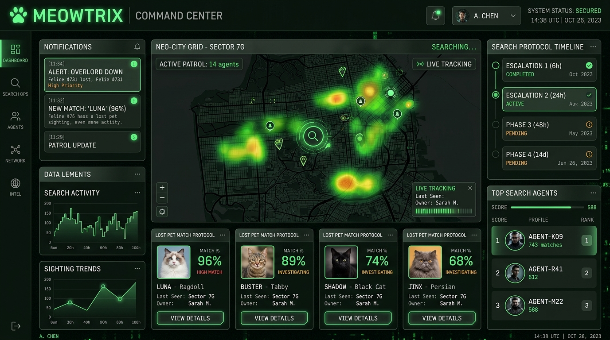
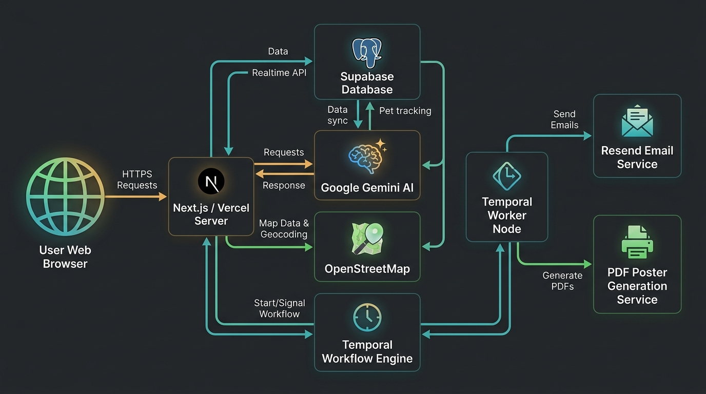
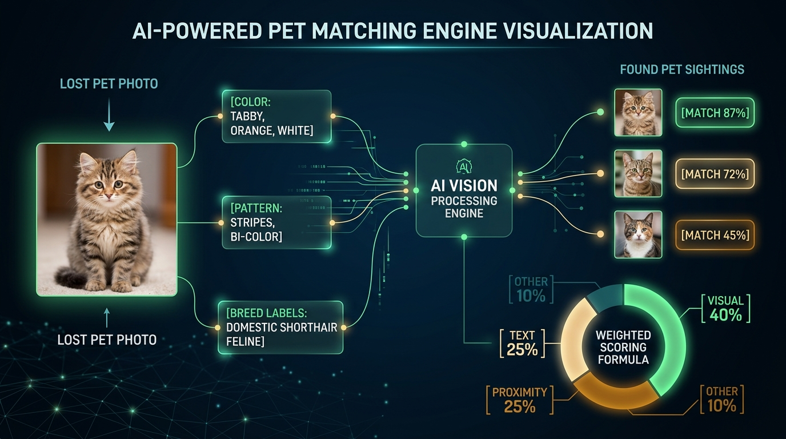

# 🐾 MEOWTRIX — Case Study

> **A real-time intelligence platform for tracking and recovering lost pets,  
> powered by AI vision and durable workflow orchestration.**

---



---

## 📌 Project Overview

|               |                                                                                     |
| ------------- | ----------------------------------------------------------------------------------- |
| **Project**   | MEOWTRIX — Pet Overlord Tracker                                                     |
| **Role**      | Full-Stack Developer                                                                |
| **Timeline**  | 2025                                                                                |
| **Stack**     | Next.js 15 · TypeScript · Supabase · Tailwind CSS · Google Gemini AI · Temporal · Vercel |
| **Category**  | AI-Powered SaaS · Real-Time Platform · Community Tool                               |

---

## 🎯 The Problem

Every year, **millions of pets go missing worldwide**. Pet owners face an agonizing ordeal — sharing blurry photos across social media groups, printing flyers, and manually scanning "found pet" posts hoping for a visual match.

The existing solutions suffer from critical gaps:

- **No intelligent matching** — owners manually compare photos across dozens of groups
- **No automated escalation** — search efforts stall after the first few hours
- **No structured verification** — reunions rely on trust alone, with no identity challenge
- **Fragmented communication** — sightings are scattered across platforms with no correlation

> *What if we could build an intelligence platform that treats every missing pet like a spy operation — with AI-powered identification, automated escalation protocols, and a community of field agents?*

---

## 💡 The Solution

**MEOWTRIX** reimagines pet recovery as a command-center operation, wrapped in a playful spy-agency aesthetic:

### Core Capabilities

| Operation         | Codename           | What it does                                                         |
| :---------------: | :----------------: | :------------------------------------------------------------------- |
| 🔴               | `OVERLORD_DOWN`     | File a missing pet report with photos, GPS location, and traits      |
| 🟢               | `AGENT_SPOTTED`     | Log a found-pet sighting — AI extracts traits from photos instantly  |
| 🧠               | `PATTERN_LOCK`      | Gemini AI compares visual traits and scores potential matches        |
| 🗺️              | `ZONE_PREDICT`      | Probability heatmaps expand over time on an interactive map          |
| ⏰               | `SEARCH_PROTOCOL`   | Automated 6h → 24h → 48h → 14d escalation workflow                  |
| ✅               | `CLAIM_VERIFY`      | 3-question identity challenge to confirm ownership before reunion    |

---

## 🏗️ Architecture Deep Dive

The system is designed as a **serverless-first, event-driven platform** that separates concerns across multiple runtime layers.



### Key Architectural Decisions

**1. Next.js 15 App Router as the API gateway**  
All data mutations flow through API routes — the client never touches Supabase directly. This enforces server-side validation (Zod schemas), keeps secrets out of the browser bundle, and centralises the match-trigger logic.

**2. Supabase as the unified backend**  
PostgreSQL with Row-Level Security on every table handles auth, data, file storage, and real-time subscriptions through a single managed service. A custom `overlords_public` view masks sensitive verification fields (secret name, marking, trait) so they're only returned to the pet's owner.

**3. Temporal for durable workflows**  
The escalating search protocol (6h → 24h → 48h → 14d) needs timers that survive server restarts, Vercel cold starts, and deployment cycles. Temporal workflows run as a separate Node.js process and are inherently **idempotent** — every stage checks `isOverlordResolved()` before executing, so early cancellation is safe.

**4. Dual Supabase clients**  
The server maintains two clients: an **anon client** for user-scoped reads (respecting RLS) and a **service-role client** for privileged writes (cross-user notifications, workflow callbacks). This separation prevents accidental privilege escalation.

### Runtime Processes

| Process              | Where it runs              | Responsibilities                                              |
| -------------------- | -------------------------- | ------------------------------------------------------------- |
| **Web App + API**    | Vercel (Node runtime)      | UI rendering, API routes, Gemini calls, Temporal workflow starts |
| **Middleware**        | Vercel Edge                | Session refresh, protected route guards                        |
| **Temporal Worker**  | Long-lived Node process    | Executes timed workflows, generates posters, sends emails      |
| **Browser Client**   | User's browser             | React UI, Leaflet maps, real-time WebSocket subscriptions      |

---

## 🧠 The AI Match Engine

The heart of MEOWTRIX is a **multi-signal scoring algorithm** that compares lost pet reports against found-pet sightings to surface the most likely matches.



### How It Works

**Step 1 — Trait Extraction (Google Gemini Vision)**  
When a user uploads a pet photo, the image is sent to Google Gemini's multimodal API. The AI extracts structured trait tags:

```json
{
  "primary_color": "orange",
  "secondary_color": "white",
  "pattern_type": "tabby",
  "breed_estimate": "domestic shorthair",
  "fur_length": "short"
}
```

**Step 2 — Multi-Signal Scoring**  
Each lost-found pair is scored across four weighted dimensions:

| Signal               | Weight | Method                                                                 |
| -------------------- | :----: | ---------------------------------------------------------------------- |
| 🎨 Visual Similarity | **40%** | Color similarity with fuzzy grouping (e.g. "ginger" ≈ "orange" = 60%) + pattern match |
| 📝 Text Description  | **25%** | Jaccard token overlap between free-text descriptions                    |
| 📍 Proximity         | **25%** | Haversine distance — inverse scoring (≤500m = 100%, decaying outward)   |
| 🧬 Other Traits      | **10%** | Breed estimate (exact = 100, substring = 50) + fur length match         |

**Step 3 — Threshold + Alert**  
Any pair scoring **≥ 60/100** triggers a real-time notification to the pet owner. A maximum of 10 suggestions are generated per lost pet to prevent alert fatigue.

### Color Similarity — A Design Decision

Rather than requiring exact color matches (which would miss "ginger" vs "orange"), the engine uses **fuzzy color grouping**:

```
light:  white, cream, ivory, beige, silver, fawn
grey:   grey, gray, charcoal, slate
brown:  brown, chocolate, tan, liver, chestnut
orange: orange, ginger, red, rust, cinnamon, apricot
black:  black, ebony
golden: golden, yellow, buff
```

Colors within the same group score **60** (instead of 0), dramatically reducing false negatives from synonym mismatches.

---

## ⏱️ Escalating Search Protocol

One of the most innovative features is the **time-based search escalation** — a durable workflow that progressively intensifies the search effort if the pet hasn't been found:

```
┌──────────────────────────────────────────────────────────────────────┐
│                    SEARCH PROTOCOL TIMELINE                         │
│                                                                      │
│  ⏱ 0h ──── 📋 Report filed                                         │
│             └─ Immediate "lost_nearby" blast (~5km bounding box)    │
│                                                                      │
│  ⏱ 6h ──── 🔔 Notify nearby helpers                                │
│             └─ Consent-based alert within 1km radius                │
│                                                                      │
│  ⏱ 24h ─── 📄 Auto-generate missing poster                         │
│             └─ PDFKit renders a printable flyer with photo + traits  │
│                                                                      │
│  ⏱ 48h ─── 📡 Expand search radius                                 │
│             └─ Radius grows to 5km, excludes already-notified users │
│                                                                      │
│  ⏱ 14d ─── 🏁 Search concluded                                     │
│             └─ Final status update to owner                          │
│                                                                      │
│  ✅ Pet found at any stage? Workflow auto-cancels immediately.       │
└──────────────────────────────────────────────────────────────────────┘
```

### Why Temporal?

Standard `setTimeout` or cron jobs can't survive:
- Vercel function cold starts and timeouts (max 60s on Hobby)
- Server redeployments during a 14-day window
- Duplicate execution on retry

Temporal provides **durable execution** — workflows persist their state across restarts, retries are automatic, and the timer logic is expressed as plain TypeScript with `await sleep()` semantics.

---

## 🛡️ Security & Trust

| Layer           | Implementation                                                           |
| --------------- | ------------------------------------------------------------------------ |
| **Database**    | Row-Level Security on every table — users only see their own data        |
| **Verification**| 3-step claim challenge with lockout after 3 failures                     |
| **Uploads**     | Format + size validation (JPEG/PNG/WebP, ≤5MB) via Sharp                 |
| **Secrets**     | Server-side only — `GEMINI_API_KEY`, `SERVICE_ROLE_KEY` never in bundles |
| **CI/CD**       | Aikido SAST + dependency audit on every PR + `npm audit` in pipeline     |

### The Claim Verification Flow

To prevent false reunions, MEOWTRIX implements a **3-question identity challenge**:

1. Owner sets three secret verification facts when filing the report (pet's real name, a distinctive marking, a behavioral trait)
2. When someone claims a match, they must answer all three correctly
3. **Three failures = permanent lockout** on that claim — preventing brute-force guessing

---

## 🗺️ Interactive Mapping

The platform uses **Leaflet.js with heatmap overlays** to visualize:

- 📍 Last known locations of lost pets
- 👁️ Sighting reports from community agents
- 🔥 Predictive probability zones that expand over time
- 📏 Search radius rings (1km → 5km progression)

Maps are dynamically imported with `ssr: false` to avoid server-side rendering issues with Leaflet's DOM dependency.

---

## 🏆 Community Gamification

To incentivize community participation, MEOWTRIX includes an **Informant Leaderboard**:

- **+10 points** per verified pet recovery
- Ties broken by earliest match timestamp
- Real-time updates via Supabase Realtime subscriptions
- Social sharing with Open Graph meta tags for bragging rights

---

## 📈 Technical Challenges & Lessons Learned

### Challenge 1: Gemini Trait Extraction Reliability
**Problem:** AI vision models occasionally return inconsistent trait tags for the same animal under different lighting.  
**Solution:** Implemented a retryable `/api/vision/process` endpoint that re-processes photos on failure, and designed the match engine to use fuzzy color grouping to absorb minor discrepancies.

### Challenge 2: Real-Time Notifications at Scale
**Problem:** Supabase Realtime subscriptions needed to push match alerts to specific users without broadcasting to everyone.  
**Solution:** Used row-level filtering on the `notifications` table — each client subscribes only to rows matching their `user_id`, leveraging Supabase's built-in RLS for the real-time channel.

### Challenge 3: Balancing Precision vs. Recall in Matching
**Problem:** Too strict → missed matches. Too loose → alert fatigue.  
**Solution:** The 60/100 threshold with a cap of 10 suggestions per pet was tuned through iteration. The weighted formula (40% visual, 25% text, 25% proximity, 10% other) reflects that visual similarity is most decisive, while proximity prevents cross-city false positives.

### Challenge 4: Durable Timers Across Serverless Boundaries
**Problem:** Vercel functions have a 60-second timeout — you can't `sleep(6 hours)` in a serverless function.  
**Solution:** Temporal's durable execution model separates timer logic into a dedicated worker process. The Next.js API route only *starts* the workflow (instant RPC call) — the worker runs independently for up to 14 days.

---

## 🔧 Tech Stack Summary

| Layer         | Technology                                | Why                                                    |
| ------------- | ----------------------------------------- | ------------------------------------------------------ |
| **Framework** | Next.js 15 (App Router)                   | Server Components, API routes, edge middleware          |
| **Language**  | TypeScript (strict mode)                  | Type safety across full stack                           |
| **Styling**   | Tailwind CSS + shadcn/ui                  | Rapid iteration with consistent design tokens           |
| **Database**  | Supabase (PostgreSQL + RLS)               | Unified auth, data, storage, and real-time              |
| **AI Vision** | Google Gemini API                         | Multimodal trait extraction from pet photos              |
| **Maps**      | Leaflet.js + OpenStreetMap                | Open-source, customizable, heatmap support              |
| **Workflows** | Temporal                                  | Durable execution for multi-day escalation timelines    |
| **Email**     | Resend                                    | Transactional email for claims and escalations           |
| **Hosting**   | Vercel                                    | Zero-config deploys, edge network, preview deploys      |
| **Security**  | Aikido                                    | Continuous SAST + dependency scanning                    |

---

## 🚀 Results & Impact

- ⚡ **Sub-second match scoring** — AI trait extraction + multi-signal scoring in a single API round-trip
- 🔔 **Real-time alerts** — owners notified within milliseconds of a match via Supabase Realtime
- 🤖 **Zero manual matching** — the AI engine eliminates the need to manually compare photos
- 📄 **Automated poster generation** — printable missing-pet flyers generated without owner effort
- 🛡️ **Secure reunions** — 3-step verification prevents false claims
- 📈 **Progressive escalation** — search intensity automatically increases over 14 days

---

<div align="center">

**🐾 MEOWTRIX — TRUST NO ONE. FIND THEM. 🐾**

*Built with Next.js, Supabase, Google Gemini AI, and Temporal.*

</div>
