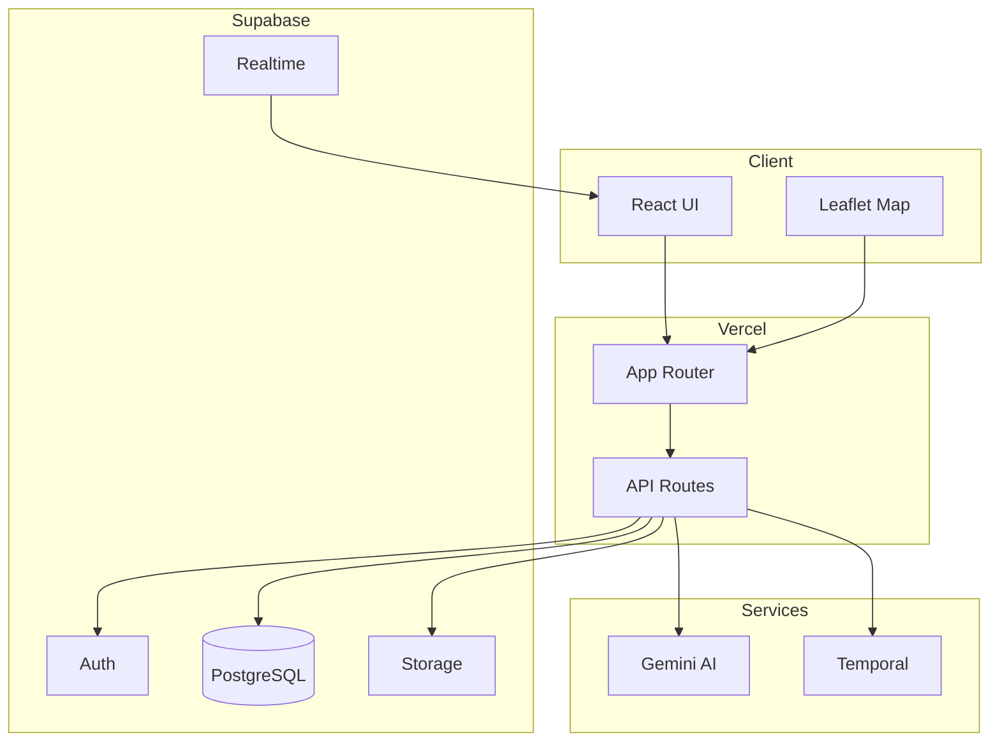

# 🐾 MEOWTRIX

### Feline Overlord Tracker

> *Your overlord is out there. We will find them.*

<br>


<br>
<br>


</div>

---

## 📡 Mission Briefing

MEOWTRIX is a real-time intelligence platform for tracking and recovering lost feline overlords. Powered by AI vision, predictive heatmaps, and escalating search protocols — wrapped in a spy-agency command-center aesthetic.

<div align="center">

</div>

---

## ⚡ Core Operations

| Operation | Codename | Description |
|:---------:|:--------:|:------------|
| 🔴 | `OVERLORD_DOWN` | File a report with photos, location, and traits |
| 🟢 | `AGENT_SPOTTED` | Log a sighting with AI-powered trait extraction |
| 🧠 | `PATTERN_LOCK` | Gemini vision compares traits for matchmaking |
| 🗺️ | `ZONE_PREDICT` | Probability zones expand over time on the map |
| ⏰ | `SEARCH_PROTOCOL` | Temporal workflows: 6h → 24h → 48h escalation |
| ✅ | `CLAIM_VERIFY` | 3-question challenge to confirm identity |

---

## 🏗️ System Architecture

<div align="center">



</div>

---

## 📊 Match Engine

The AI-powered match engine scores potential overlord-agent pairs:

| Factor | Weight | Method |
|--------|:------:|--------|
| Visual Similarity | 40% | Gemini trait tag comparison |
| Text Comparison | 25% | Jaccard token overlap |
| Proximity Score | 25% | Inverse distance (≤500m = 100%) |
| Other Traits | 10% | Breed + fur length matching |

> **Threshold:** ≥ 60/100 to generate an alert. Max 10 suggestions per overlord.

---

## ⏱️ Escalating Search Protocol

Powered by **Temporal** durable workflows:

| Time | Action | Radius |
|:----:|--------|:------:|
| 0h | 📋 Report filed | — |
| 6h | 🔔 Notify nearby informants | 1km |
| 24h | 📄 Auto-generate missing poster (PDF) | — |
| 48h | 📡 Expand alert radius | 5km |
| 14d | 🏁 Search concluded | — |

If the overlord is recovered at any stage, the workflow cancels automatically.

---

## 🛡️ Security

| Layer | Implementation |
|-------|---------------|
| Database | Row Level Security on all tables |
| Verification | 3-step claim challenge (locked after 3 failures) |
| Uploads | Format + size validation (JPEG/PNG/WebP, ≤5MB) |
| Secrets | Server-side only — no keys in client bundles |
| Scanning | Aikido SAST + Dependency Audit (continuous) |

---

## 🏆 Informant Leaderboard

+10 points per verified recovery. Ties broken by earliest match timestamp.

Real-time updates via Supabase subscriptions. Social sharing with Open Graph meta tags.

<div align="center">

</div>

---

## 🚀 Quick Start

### Prerequisites

- Node.js ≥ 18.0.0
- npm ≥ 9.0.0
- Supabase project
- Temporal server (local or cloud)

### Environment Variables

```env
NEXT_PUBLIC_SUPABASE_URL=your_supabase_url
NEXT_PUBLIC_SUPABASE_ANON_KEY=your_anon_key
SUPABASE_SERVICE_ROLE_KEY=your_service_role_key
GEMINI_API_KEY=your_gemini_key
TEMPORAL_ADDRESS=your_temporal_address
```

### Launch Sequence

```bash
git clone https://github.com/your-username/meowtrix.git
cd meowtrix
npm install
npx supabase db push
npx ts-node scripts/seed.ts
npm run dev
```

> 🟢 System online at `http://localhost:3000`

---

## 🗂️ Project Structure

```
meowtrix/
├── app/
│   ├── (auth)/             # Login & Registration
│   ├── (protected)/        # Dashboard, Map, Reports, Leaderboard
│   └── api/                # Server-side routes
├── components/
│   ├── ui/                 # shadcn/ui primitives
│   ├── map/                # Leaflet map + heatmap
│   ├── forms/              # Report & claim forms
│   └── leaderboard/        # Ranking table
├── hooks/                  # Custom React hooks
├── lib/                    # Utilities & algorithms
├── temporal/               # Workflow definitions
├── types/                  # TypeScript interfaces
└── scripts/                # Seed & utility scripts
```

---

## 🔧 Built With

| Layer | Technology |
|-------|-----------|
| Framework | Next.js 14 (App Router) |
| Language | TypeScript (strict mode) |
| Styling | Tailwind CSS + shadcn/ui |
| Database | Supabase (PostgreSQL + RLS) |
| Auth | Supabase Auth |
| Storage | Supabase Storage |
| AI Vision | Google Gemini API |
| Maps | Leaflet.js + OpenStreetMap |
| Workflows | Temporal |
| Security | Aikido (SAST + Deps) |
| Hosting | Vercel |

---

## 📜 License

MIT

---

<div align="center">


<br>

**MEOWTRIX — TRUST NO ONE. FIND THEM.**

</div>
]]>