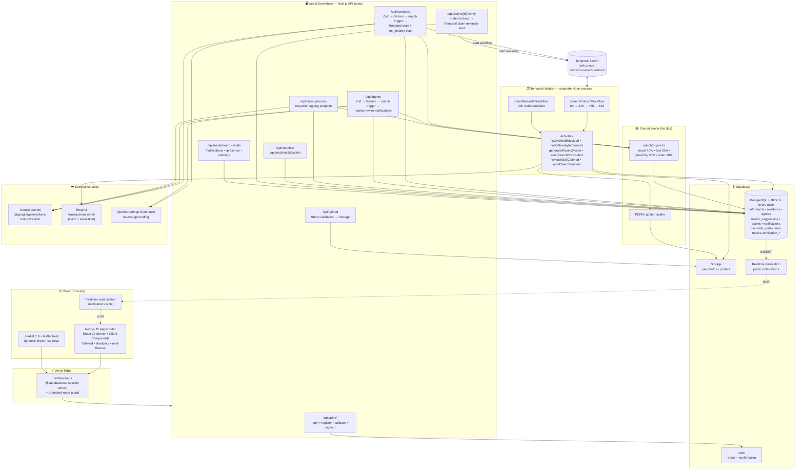

# 🐾 MEOWTRIX

### Pet Overlord Tracker

> *Your overlord is out there. We will find them.*

<br>


<br>
<br>


</div>

---

## 📡 Mission Briefing

MEOWTRIX is a real-time intelligence platform for tracking and recovering lost pet overlords — cats and dogs alike. Powered by AI vision, predictive heatmaps, and escalating search protocols — wrapped in a spy-agency command-center aesthetic.

<div align="center">

</div>

---

## ⚡ Core Operations

| Operation | Codename | Description |
|:---------:|:--------:|:------------|
| 🔴 | `OVERLORD_DOWN` | File a report with photos, location, and traits |
| 🟢 | `AGENT_SPOTTED` | Log a sighting with AI-powered trait extraction |
| 🧠 | `PATTERN_LOCK` | Gemini vision compares traits for matchmaking |
| 🗺️ | `ZONE_PREDICT` | Probability zones expand over time on the map |
| ⏰ | `SEARCH_PROTOCOL` | Temporal workflows: 6h notify → 24h flyer → 48h expand → 14d conclude |
| ✅ | `CLAIM_VERIFY` | 3-question challenge to confirm identity |

---

## 🏗️ System Architecture

The browser talks to Next.js on Vercel. A middleware refreshes the Supabase session
and gates protected routes. API routes are the only place Supabase is touched, and
they call out to Google Gemini for trait extraction, OpenStreetMap for reverse
geocoding, and Temporal to start durable workflows. A separate Temporal worker
process executes those workflows and writes back into Supabase (posters to Storage,
alerts to the `notifications` table). Supabase Realtime pushes new notification
rows to the client for live match alerts and search updates.

<div align="center">



</div>

### Runtime processes

| Process | Where it runs | Talks to |
|---|---|---|
| **Web app + API routes** | Vercel (Node runtime) | Supabase (anon + service role), Gemini, OpenStreetMap, Temporal (client) |
| **Middleware** | Vercel Edge | Supabase Auth (session refresh) |
| **Temporal worker** | Long-lived Node process (`npm run worker`) | Temporal Server, Supabase (service role), Resend |
| **Browser client** | User's browser | API routes, Supabase Realtime (WebSocket) |

### Data-plane rules

- **Never in the client bundle.** `SUPABASE_SERVICE_ROLE_KEY`, `GEMINI_API_KEY`, `RESEND_API_KEY`, and Temporal credentials are read only server-side.
- **RLS is on for every table.** Sensitive verification fields (`verification_name`, `verification_marking`, `verification_trait`) are exposed through the `overlords_public` view, which returns them only to the owner.
- **Two Supabase clients on the server.** The anon client is used for user-scoped reads inside a request; the service-role client is used for privileged writes (workflow starts, cross-user notification inserts).
- **Idempotent workflows.** Every escalation stage first calls `isOverlordResolved(overlordId)` and short-circuits if the pet has been recovered, so cancellation is safe at any point.

---

## 📊 Match Engine

The AI-powered match engine scores potential overlord-agent pairs:

| Factor | Weight | Method |
|--------|:------:|--------|
| Visual Similarity | 40% | Gemini trait tag comparison |
| Text Comparison | 25% | Jaccard token overlap |
| Proximity Score | 25% | Inverse distance (≤500m = 100%) |
| Other Traits | 10% | Breed + fur length matching |

> **Threshold:** ≥ 60/100 to generate an alert. Max 10 suggestions per overlord.

---

## ⏱️ Escalating Search Protocol

Powered by **Temporal** durable workflows:

| Time | Action | Radius |
|:----:|--------|:------:|
| 0h | 📋 Report filed (immediate `lost_nearby` blast, ~5km bounding box) | 5km |
| 6h | 🔔 Notify nearby helpers with location consent | 1km |
| 24h | 📄 Auto-generate printable missing poster (PDF) | — |
| 48h | 📡 Expand alert radius (excludes already-notified helpers) | 5km |
| 14d | 🏁 Search concluded | — |

If the overlord is recovered at any stage, the workflow short-circuits automatically. Tier delays are configurable at runtime via `SEARCH_PROTOCOL_STAGE*_DELAY_MS` env vars — see `.env.example` for the full list.

### Running the Temporal worker

The Next.js server *starts* workflows, but a separate worker process polls the task queue and executes them. Run it alongside `npm run dev`:

```bash
npm run worker         # one-shot
npm run worker:dev     # auto-reload on file changes
```

Make sure `TEMPORAL_ADDRESS`, `NEXT_PUBLIC_SUPABASE_URL`, and `SUPABASE_SERVICE_ROLE_KEY` are set in `.env.local`.

---

## 🛡️ Security

| Layer | Implementation |
|-------|---------------|
| Database | Row Level Security on all tables |
| Verification | 3-step claim challenge (locked after 3 failures) |
| Uploads | Format + size validation (JPEG/PNG/WebP, ≤5MB) |
| Secrets | Server-side only — no keys in client bundles |
| Scanning | Aikido SAST + Dependency Audit (continuous) + `npm audit` in CI |

### Aikido setup

Aikido runs both **continuously** (via the Aikido GitHub App on the repo) and **in-CI** (via `.github/workflows/security.yml`, which runs on every PR and push to `main`).

To enable the in-CI gate:

1. Sign in to the [Aikido dashboard](https://app.aikido.dev) and connect this GitHub repo (Settings → Integrations → GitHub).
2. Grab a CI API key from *Settings → Integrations → Continuous Integration*.
3. In this repo's GitHub Settings, add a repository secret named `AIKIDO_API_KEY` with that value.
4. Push a PR — the `Aikido Security Scan` job will run automatically. High-severity SAST or secret findings will block the merge; dependency findings are surfaced non-blockingly.

The workflow also runs `npm audit --audit-level=high --production`, `tsc --noEmit`, and `npm run lint` on every push. Suppressions for Aikido are managed via `.aikido/config.yml`.

---

## 🏆 Informant Leaderboard

+10 points per verified recovery. Ties broken by earliest match timestamp.

Real-time updates via Supabase subscriptions. Social sharing with Open Graph meta tags.

<div align="center">

</div>

---

## 🚀 Quick Start

### Prerequisites

- Node.js ≥ 18.0.0
- npm ≥ 9.0.0
- Supabase project
- Temporal server (local or cloud)

### Environment Variables

```env
NEXT_PUBLIC_SUPABASE_URL=your_supabase_url
NEXT_PUBLIC_SUPABASE_ANON_KEY=your_anon_key
SUPABASE_SERVICE_ROLE_KEY=your_service_role_key
GEMINI_API_KEY=your_gemini_key
TEMPORAL_ADDRESS=your_temporal_address
```

### Launch Sequence

```bash
git clone https://github.com/your-username/meowtrix.git
cd meowtrix
npm install
npx supabase db push
npx ts-node scripts/seed.ts
npm run dev
```

> 🟢 System online at `http://localhost:3000`

---

## 🗂️ Project Structure

```
meowtrix/
├── app/
│   ├── (auth)/             # Login & Registration
│   ├── (protected)/        # Dashboard, Map, Reports, Leaderboard
│   └── api/                # Server-side routes
├── components/
│   ├── ui/                 # shadcn/ui primitives
│   ├── map/                # Leaflet map + heatmap
│   ├── forms/              # Report & claim forms
│   └── leaderboard/        # Ranking table
├── hooks/                  # Custom React hooks
├── lib/                    # Utilities & algorithms
├── temporal/               # Workflow definitions
├── types/                  # TypeScript interfaces
└── scripts/                # Seed & utility scripts
```

---

## 🔧 Built With

| Layer | Technology |
|-------|-----------|
| Framework | Next.js 14 (App Router) |
| Language | TypeScript (strict mode) |
| Styling | Tailwind CSS + shadcn/ui |
| Database | Supabase (PostgreSQL + RLS) |
| Auth | Supabase Auth |
| Storage | Supabase Storage |
| AI Vision | Google Gemini API |
| Maps | Leaflet.js + OpenStreetMap |
| Workflows | Temporal |
| Security | Aikido (SAST + Deps) |
| Hosting | Vercel |

---

## 📜 License

MIT

---

<div align="center">


<br>

**MEOWTRIX — TRUST NO ONE. FIND THEM.**

</div>