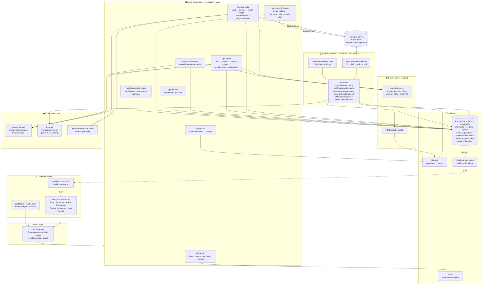

# 🐾 MEOWTRIX

### Pet Overlord Tracker

> *Your overlord is out there. We will find them.*

<br>


<br>
<br>


</div>

---

## 📡 Mission Briefing

MEOWTRIX is a real-time intelligence platform for tracking and recovering lost pet overlords — cats and dogs alike. Powered by AI vision, predictive heatmaps, and escalating search protocols — wrapped in a spy-agency command-center aesthetic.

<div align="center">

</div>

---

## 📋 1. Pre-requisites

Install these before you start. Version numbers are what we build and test against.

| Software | Minimum version | Check | Install |
|---|---|---|---|
| **Node.js** | ≥ 18.17 (LTS 20 recommended) | `node --version` | [nodejs.org](https://nodejs.org) |
| **npm** | ≥ 9.0 | `npm --version` | ships with Node |
| **Git** | any recent | `git --version` | [git-scm.com](https://git-scm.com) |
| **Supabase account** | free tier is fine | — | [supabase.com](https://supabase.com) |
| **Supabase CLI** | latest | `npx supabase --version` | runs via `npx`, no install needed |
| **Google AI Studio account** | free tier | — | [aistudio.google.com](https://aistudio.google.com) — for a `GEMINI_API_KEY` |
| **Temporal server** | latest | `temporal --version` | [Temporal CLI](https://docs.temporal.io/cli) *(optional — only if you want the escalating search timeline to run)* |
| **Resend account** | free tier | — | [resend.com](https://resend.com) *(optional — only for sending real emails)* |

> 💡 **Zero-config path:** the app runs against Supabase and Gemini alone. Temporal and Resend are only needed if you want the 6h → 24h → 48h → 14d search timeline and outbound email to actually fire.

---

## 🚀 2. How to run

<div align="center">

</div>

### Step 1 — Clone and install

```bash
git clone https://github.com/your-username/meowtrix.git
cd meowtrix
npm install
```

### Step 2 — Create your `.env.local`

Copy the template and fill in your keys (see [Section 3](#-3-configuration) for what each value means):

```bash
cp .env.example .env.local
```

At a minimum, fill in `NEXT_PUBLIC_SUPABASE_URL`, `NEXT_PUBLIC_SUPABASE_ANON_KEY`, `SUPABASE_SERVICE_ROLE_KEY`, `RESEND_API_KEY`, `RESEND_FROM_EMAIL` and `GEMINI_API_KEY`.

### Step 3 — Push the database schema

```bash
npx supabase link --project-ref <your-project-ref>
npx supabase db push
```

> `<your-project-ref>` is the ID in your Supabase project URL (e.g. `abcdxyz` from `https://abcdxyz.supabase.co`).

### Step 4 — (Optional) Seed demo data

```bash
npm run seed           # inserts sample overlords, agents, and matches
npm run seed:cleanup   # wipes the seed data when you're done
```

### Step 5 — Start the dev server

```bash
npm run dev
```

> 🟢 System online at [http://localhost:3000](http://localhost:3000)

### Step 6 — (Optional) Start the Temporal worker

The Next.js server *starts* workflows, but a separate worker process actually executes them. Open a **second terminal** and run:

```bash
# start a local Temporal server (in a third terminal, or use Temporal Cloud)
temporal server start-dev

# then run the worker
npm run worker         # one-shot
npm run worker:dev     # auto-reload on file changes
```

Without a running worker, reports still save and matches still surface — only the timed escalations (poster generation at 24h, radius expansion at 48h, etc.) will queue up but not execute.

### Other useful commands

| Command | What it does |
|---|---|
| `npm run build` | Production build (also runs type-checking) |
| `npm run start` | Serve the production build |
| `npm run lint` | ESLint over the whole project |
| `npm run test` | Vitest one-shot run |
| `npm run test:watch` | Vitest in watch mode |
| `npm run test:coverage` | Vitest with coverage report |

---

## 🔧 3. Configuration

All configuration lives in **`.env.local`** at the project root. Copy `.env.example` to get started — never commit `.env.local` to git.

<div align="center">

</div>

### 🔑 Required — Supabase

The database, auth, and file storage backend.

| Variable | What it is | Where to find it |
|---|---|---|
| `NEXT_PUBLIC_SUPABASE_URL` | Your project URL, e.g. `https://abcd.supabase.co` | Supabase dashboard → **Settings → API → Project URL** |
| `NEXT_PUBLIC_SUPABASE_ANON_KEY` | Public anon key, safe to expose to the browser | Supabase dashboard → **Settings → API → anon public** |
| `SUPABASE_SERVICE_ROLE_KEY` | Privileged server key. **Never** commit or ship to the client. | Supabase dashboard → **Settings → API → service_role** |

**How to change:** edit `.env.local`, save, then restart `npm run dev`. `NEXT_PUBLIC_*` values are baked into the browser bundle at build time, so a restart is required for them to take effect.

### 🧠 Required — Gemini AI vision

Extracts cat/dog traits from uploaded photos and powers the match engine.

| Variable | What it is | Where to find it |
|---|---|---|
| `GEMINI_API_KEY` | Google Generative AI key | [Google AI Studio → Get API key](https://aistudio.google.com/app/apikey) |

**How to change:** paste a new key into `.env.local` and restart the dev server. The key is used server-side only.

### ⏱️ Optional — Temporal (durable search timeline)

Only needed if you want the escalating search protocol (6h → 24h → 48h → 14d) to actually fire.

| Variable | Default | What it controls |
|---|---|---|
| `TEMPORAL_ADDRESS` | `localhost:7233` | Address of your Temporal server. Use your Temporal Cloud endpoint for prod. |
| `TEMPORAL_NAMESPACE` | `default` | Temporal namespace to run in. |
| `TEMPORAL_TASK_QUEUE` | `meowtrix-search-protocol` | Task queue name — must match between the API and the worker. |
| `TEMPORAL_API_KEY` | *(empty)* | For **Temporal Cloud** — enables TLS + Bearer auth. Leave blank for local dev. |
| `TEMPORAL_TLS_CERT` / `TEMPORAL_TLS_KEY` | *(empty)* | Alternative to `TEMPORAL_API_KEY`: mTLS PEM contents (not file paths). |

### 🕐 Optional — Search protocol tier overrides (great for demos)

Real production waits **6h → 24h → 48h → 14d**. For a live demo you probably want faster tiers. Uncomment these in `.env.local` and set your own delays (in **milliseconds**):

| Variable | Default | Demo value |
|---|---|---|
| `SEARCH_PROTOCOL_STAGE1_DELAY_MS` | `21_600_000` (6h) | `60000` (1 min → notify nearby helpers) |
| `SEARCH_PROTOCOL_STAGE2_DELAY_MS` | `64_800_000` (18h) | `300000` (5 min → generate PDF poster) |
| `SEARCH_PROTOCOL_STAGE3_DELAY_MS` | `86_400_000` (24h) | `900000` (15 min → expand radius to 5km) |
| `SEARCH_PROTOCOL_STAGE4_DELAY_MS` | `1_036_800_000` (12d) | `1800000` (30 min → conclude search) |
| `SEARCH_PROTOCOL_STAGE1_RADIUS_M` | `1000` | Notify radius for Stage 1 (meters) |
| `SEARCH_PROTOCOL_STAGE3_RADIUS_M` | `5000` | Expanded radius for Stage 3 (meters) |

**How to change:** the worker reads these on startup — restart `npm run worker` after editing.

### 📧 Optional — Resend (transactional email)

Sends claim-verification and search-escalation emails. Without it, notifications still land in the in-app inbox — you just won't get real email.

| Variable | What it is |
|---|---|
| `RESEND_API_KEY` | API key from [resend.com/api-keys](https://resend.com/api-keys) |
| `RESEND_FROM_EMAIL` | Verified sender address, e.g. `noreply@yourdomain.com` |
| `NEXT_PUBLIC_APP_URL` | Base URL for links inside emails. `http://localhost:3000` for local, your deployed URL for prod. |

### 🌱 Optional — Seed & Telegram

| Variable | Purpose |
|---|---|
| `SEED_DATA` / `SEED_CLEANUP` | Toggle sample-data insertion / removal used by `npm run seed`. |
| `TELEGRAM_BOT_TOKEN` / `TELEGRAM_CHAT_ID` | If you want deploy notifications to hit a Telegram channel (see `.github/workflows/deploy-notify.yml`). |

### After changing configuration

- **Server env vars** (anything **not** prefixed with `NEXT_PUBLIC_`): restart the running process (`npm run dev` or `npm run worker`).
- **Client env vars** (`NEXT_PUBLIC_*`): stop and re-run `npm run dev` so Next.js re-bundles them.
- **Production on Vercel:** set the same variables under **Project Settings → Environment Variables**, then redeploy.

---

## ⚡ Core Operations

| Operation | Codename | Description |
|:---------:|:--------:|:------------|
| 🔴 | `OVERLORD_DOWN` | File a report with photos, location, and traits |
| 🟢 | `AGENT_SPOTTED` | Log a sighting with AI-powered trait extraction |
| 🧠 | `PATTERN_LOCK` | Gemini vision compares traits for matchmaking |
| 🗺️ | `ZONE_PREDICT` | Probability zones expand over time on the map |
| ⏰ | `SEARCH_PROTOCOL` | Temporal workflows: 6h notify → 24h flyer → 48h expand → 14d conclude |
| ✅ | `CLAIM_VERIFY` | 3-question challenge to confirm identity |

---

## 🏗️ System Architecture

The browser talks to Next.js on Vercel. A middleware refreshes the Supabase session
and gates protected routes. API routes are the only place Supabase is touched, and
they call out to Google Gemini for trait extraction, OpenStreetMap for reverse
geocoding, and Temporal to start durable workflows. A separate Temporal worker
process executes those workflows and writes back into Supabase (posters to Storage,
alerts to the `notifications` table). Supabase Realtime pushes new notification
rows to the client for live match alerts and search updates.

<div align="center">



</div>

### Runtime processes

| Process | Where it runs | Talks to |
|---|---|---|
| **Web app + API routes** | Vercel (Node runtime) | Supabase (anon + service role), Gemini, OpenStreetMap, Temporal (client) |
| **Middleware** | Vercel Edge | Supabase Auth (session refresh) |
| **Temporal worker** | Long-lived Node process (`npm run worker`) | Temporal Server, Supabase (service role), Resend |
| **Browser client** | User's browser | API routes, Supabase Realtime (WebSocket) |

### Data-plane rules

- **Never in the client bundle.** `SUPABASE_SERVICE_ROLE_KEY`, `GEMINI_API_KEY`, `RESEND_API_KEY`, and Temporal credentials are read only server-side.
- **RLS is on for every table.** Sensitive verification fields (`verification_name`, `verification_marking`, `verification_trait`) are exposed through the `overlords_public` view, which returns them only to the owner.
- **Two Supabase clients on the server.** The anon client is used for user-scoped reads inside a request; the service-role client is used for privileged writes (workflow starts, cross-user notification inserts).
- **Idempotent workflows.** Every escalation stage first calls `isOverlordResolved(overlordId)` and short-circuits if the pet has been recovered, so cancellation is safe at any point.

---

## 📊 Match Engine

The AI-powered match engine scores potential overlord-agent pairs:

| Factor | Weight | Method |
|--------|:------:|--------|
| Visual Similarity | 40% | Gemini trait tag comparison |
| Text Comparison | 25% | Jaccard token overlap |
| Proximity Score | 25% | Inverse distance (≤500m = 100%) |
| Other Traits | 10% | Breed + fur length matching |

> **Threshold:** ≥ 60/100 to generate an alert. Max 10 suggestions per overlord.

---

## ⏱️ Escalating Search Protocol

Powered by **Temporal** durable workflows:

| Time | Action | Radius |
|:----:|--------|:------:|
| 0h | 📋 Report filed (immediate `lost_nearby` blast, ~5km bounding box) | 5km |
| 6h | 🔔 Notify nearby helpers with location consent | 1km |
| 24h | 📄 Auto-generate printable missing poster (PDF) | — |
| 48h | 📡 Expand alert radius (excludes already-notified helpers) | 5km |
| 14d | 🏁 Search concluded | — |

If the overlord is recovered at any stage, the workflow short-circuits automatically. Tier delays are configurable at runtime via `SEARCH_PROTOCOL_STAGE*_DELAY_MS` env vars — see [Section 3](#-3-configuration).

---

## 🛡️ Security

| Layer | Implementation |
|-------|---------------|
| Database | Row Level Security on all tables |
| Verification | 3-step claim challenge (locked after 3 failures) |
| Uploads | Format + size validation (JPEG/PNG/WebP, ≤5MB) |
| Secrets | Server-side only — no keys in client bundles |
| Scanning | Aikido SAST + Dependency Audit (continuous) + `npm audit` in CI |

### Aikido setup

Aikido runs both **continuously** (via the Aikido GitHub App on the repo) and **in-CI** (via `.github/workflows/security.yml`, which runs on every PR and push to `main`).

To enable the in-CI gate:

1. Sign in to the [Aikido dashboard](https://app.aikido.dev) and connect this GitHub repo (Settings → Integrations → GitHub).
2. Grab a CI API key from *Settings → Integrations → Continuous Integration*.
3. In this repo's GitHub Settings, add a repository secret named `AIKIDO_API_KEY` with that value.
4. Push a PR — the `Aikido Security Scan` job will run automatically. High-severity SAST or secret findings will block the merge; dependency findings are surfaced non-blockingly.

The workflow also runs `npm audit --audit-level=high --production`, `tsc --noEmit`, and `npm run lint` on every push. Suppressions for Aikido are managed via `.aikido/config.yml`.

---

## 🏆 Informant Leaderboard

+10 points per verified recovery. Ties broken by earliest match timestamp.

Real-time updates via Supabase subscriptions. Social sharing with Open Graph meta tags.

---

## 🗂️ Project Structure

```
meowtrix/
├── app/
│   ├── (auth)/             # Login & Registration
│   ├── (protected)/        # Dashboard, Map, Reports, Leaderboard
│   └── api/                # Server-side routes
├── components/
│   ├── ui/                 # shadcn/ui primitives
│   ├── map/                # Leaflet map + heatmap
│   ├── forms/              # Report & claim forms
│   └── leaderboard/        # Ranking table
├── hooks/                  # Custom React hooks
├── lib/                    # Utilities & algorithms
├── temporal/               # Workflow definitions
├── types/                  # TypeScript interfaces
└── scripts/                # Seed & utility scripts
```

---

## 🔧 Built With

| Layer | Technology |
|-------|-----------|
| Framework | Next.js 15 (App Router) |
| Language | TypeScript (strict mode) |
| Styling | Tailwind CSS + shadcn/ui |
| Database | Supabase (PostgreSQL + RLS) |
| Auth | Supabase Auth |
| Storage | Supabase Storage |
| AI Vision | Google Gemini API |
| Maps | Leaflet.js + OpenStreetMap |
| Workflows | Temporal |
| Security | Aikido (SAST + Deps) |
| Hosting | Vercel |

---

## 📜 License

MIT

---

<div align="center">

**MEOWTRIX — TRUST NO ONE. FIND THEM.**

</div>
